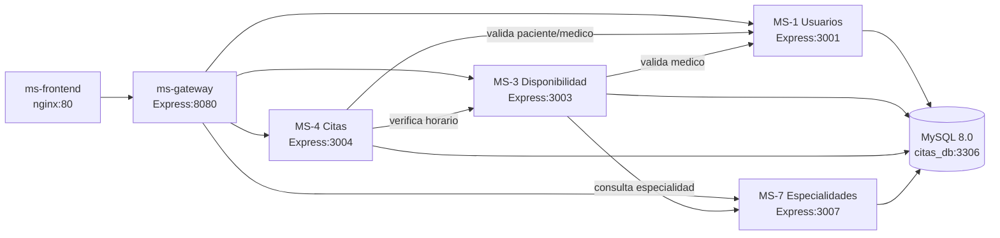

# Documento tecnico actualizado - Plataforma de Gestion de Citas Medicas

## 1) Alcance y estado actual
Este documento describe el estado implementado del sistema en:
`D:\Universidad\Sistemas Distribuidos\GestionCitasMedicas\PrototipoGestionCitasMedicas`

Fecha de actualizacion: **26/04/2026**.

---

## 2) Evolucion del primer corte al estado actual

| Componente | Primer corte (propuesto/anterior) | Estado actual verificado |
|---|---|---|
| Microservicios backend | 2 (MS-1, MS-4) | 4 microservicios: MS-1, MS-3, MS-4, MS-7 |
| API Gateway | No | Si, `ms-gateway` (Express + proxy HTTP) |
| Frontend | No | Si, SPA en `ms-frontend` (nginx) |
| Base de datos | PostgreSQL 15 (propuesta inicial) | MySQL 8.0 en contenedor |
| Comunicacion inter-servicio | Minima | Flujos REST directos entre MS + enrutamiento centralizado por gateway |
| Endpoints por servicio | Basico | 6-7 endpoints por MS + rutas agregadas del gateway |
| CORS | No definido | Habilitado en backend y gateway |
| Contenerizacion | Parcial | Dockerfiles por servicio + `docker-compose.yml` |
| Variables de entorno | Parciales | Definidas para MS, DB y Gateway |

---

## 3) Servicios existentes e implementados

### 3.1 Backend de dominio
1. **MS-1 Gestion de Usuarios** (`ms-usuarios`, interno 3001)
2. **MS-3 Disponibilidad Medica** (`ms-disponibilidad`, interno 3003)
3. **MS-4 Gestion de Citas** (`ms-citas`, interno 3004)
4. **MS-7 Especialidades Medicas** (`ms-especialidades`, interno 3007)

### 3.2 Capa de entrada
5. **MS-Gateway** (`ms-gateway`, publico 8080)
- Punto unico de entrada a APIs.
- Enruta a microservicios internos mediante nombres de servicio Docker.

### 3.3 Interfaz
6. **Frontend SPA** (`ms-frontend`, publico 80)
- Consume exclusivamente el Gateway en `http://localhost:8080/api/...`.

### 3.4 Infraestructura
7. **MySQL 8.0** (`mysql`, publico 3306)
- Inicializacion de esquema y datos mediante `init.sql`.
- Persistencia por volumen `mysql_data`.

---

## 4) Funcionalidades operativas

### MS-1 Usuarios
- Crear, listar, consultar, actualizar y desactivar usuarios.
- Validacion de roles (`paciente`, `medico`, `admin`) y email unico.

### MS-7 Especialidades
- Crear, listar, consultar, actualizar y desactivar especialidades.

### MS-3 Disponibilidad
- Registrar, listar, consultar y eliminar bloques de disponibilidad.
- Verificacion de disponibilidad por fecha/hora.
- Validacion de medico en MS-1.
- Enriquecimiento con especialidad desde MS-7.

### MS-4 Citas
- Agendar, listar, consultar, cancelar y completar citas.
- Validaciones distribuidas antes de agendar:
  - paciente valido en MS-1
  - medico valido en MS-1
  - horario disponible en MS-3
- Control de conflicto de horario en BD.

### MS-Gateway
- Ruta de salud: `GET /health`.
- Proxy unificado:
  - `/api/usuarios/*`
  - `/api/disponibilidad/*`
  - `/api/citas/*`
  - `/api/especialidades/*`

### Frontend SPA
- Dashboard y modulos de CRUD funcionales.
- Estado de servicios via `health`.
- Operacion sobre APIs mediante Gateway.

---

## 5) Componentes aun no desarrollados

Respecto a la propuesta inicial, aun no se evidencian:

1. **MS-2 Autenticacion y control de acceso** (JWT/login/roles avanzados).
2. **MS-5 Historial de citas** independiente.
3. **MS-6 Notificaciones** asincronas (correo/eventos).
4. **Broker de mensajeria** (ej. RabbitMQ/Kafka).
5. **Database-per-service** (actualmente hay BD compartida).

Nota: el **API Gateway ya fue implementado** en este ajuste.

---

## 6) Diagrama actualizado del sistema

Herramienta: Mermaid (compatible con diagrams.net mediante import/conversion).

---

## 7) Comunicacion entre servicios

### 7.1 Comunicacion cliente -> sistema
- `Frontend -> Gateway -> Microservicio destino`.
- El cliente externo no requiere conocer puertos internos de cada MS.

### 7.2 Flujos REST internos
1. `MS-4 -> MS-1`: `GET /usuarios/:id` (validar paciente).
2. `MS-4 -> MS-1`: `GET /usuarios/:id` (validar medico).
3. `MS-4 -> MS-3`: `GET /disponibilidad/verificar`.
4. `MS-3 -> MS-1`: `GET /usuarios/:id` (validar medico).
5. `MS-3 -> MS-7`: `GET /especialidades/:id` (enriquecer respuesta).

Uso de nombres Docker: `ms-usuarios`, `ms-disponibilidad`, `ms-citas`, `ms-especialidades`.

---

## 8) Endpoints implementados

### Gateway (8080)
- `GET /`
- `GET /health`
- `ALL /api/usuarios/*`
- `ALL /api/disponibilidad/*`
- `ALL /api/citas/*`
- `ALL /api/especialidades/*`

### MS-1 Usuarios (3001 interno)
- `GET /`
- `GET /health`
- `GET /usuarios`
- `GET /usuarios/:id`
- `POST /usuarios`
- `PUT /usuarios/:id`
- `DELETE /usuarios/:id`

### MS-3 Disponibilidad (3003 interno)
- `GET /`
- `GET /health`
- `GET /disponibilidad`
- `GET /disponibilidad/verificar`
- `GET /disponibilidad/:id`
- `POST /disponibilidad`
- `DELETE /disponibilidad/:id`

### MS-4 Citas (3004 interno)
- `GET /`
- `GET /health`
- `GET /citas`
- `GET /citas/:id`
- `POST /citas`
- `PATCH /citas/:id/cancelar`
- `PATCH /citas/:id/completar`

### MS-7 Especialidades (3007 interno)
- `GET /`
- `GET /health`
- `GET /especialidades`
- `GET /especialidades/:id`
- `POST /especialidades`
- `PUT /especialidades/:id`
- `DELETE /especialidades/:id`

---

## 9) Variables de entorno y configuracion

Archivo base: `.env.example`.

Variables destacadas:
- BD: `DB_HOST`, `DB_PORT`, `DB_USER`, `DB_PASSWORD`, `DB_NAME`, `MYSQL_ROOT_PASSWORD`.
- Puertos host: `PORT_FRONTEND`, `PORT_GATEWAY`, `PORT_MYSQL`.
- Puertos internos: `PORT_MS_USUARIOS`, `PORT_MS_DISPONIBILIDAD`, `PORT_MS_CITAS`, `PORT_MS_ESPECIALIDADES`.
- Enrutamiento interno: `MS_USUARIOS_URL`, `MS_DISPONIBILIDAD_URL`, `MS_CITAS_URL`, `MS_ESPECIALIDADES_URL`.

Gestion de configuracion:
- `docker-compose.yml` centraliza puertos, dependencias y red.
- Credenciales y conexiones se externalizan por variables de entorno.

---

## 10) Portabilidad del sistema

1. Dockerfiles por servicio (Node 18 Alpine / nginx Alpine).
2. Docker Compose para orquestacion integral.
3. Red `citas_net` para comunicacion interna.
4. Volumen `mysql_data` para persistencia.
5. `init.sql` para aprovisionamiento reproducible.
6. Gateway como fachada unica para cliente.

---

## 11) Flujo completo de interaccion (con Gateway)

### Caso: agendar cita
1. Cliente envia `POST /api/citas/citas` al **Gateway**.
2. Gateway reenvia a **MS-4** (`/citas`).
3. MS-4 valida paciente y medico en **MS-1**.
4. MS-4 valida horario en **MS-3**.
5. Si es valido, MS-4 registra cita en MySQL.
6. MS-4 responde al Gateway y Gateway responde al cliente.

Resultado:
- `422` ante fallas de validacion distribuida.
- `409` ante conflicto de horario.
- `201` cuando se agenda correctamente.

---

## 12) Justificacion de decisiones

1. **Gateway como punto unico de entrada**
   - Reduce acoplamiento cliente-microservicio.
   - Simplifica seguridad, versionado y evolucion futura.

2. **Microservicios REST con Express**
   - Implementacion clara y mantenible para entorno academico.

3. **Validaciones sincronas entre servicios**
   - Aseguran consistencia funcional en operaciones criticas.

4. **MySQL compartida en esta fase**
   - Menor complejidad operativa en prototipo.
   - Facilita pruebas integradas de extremo a extremo.

5. **Docker Compose**
   - Estandariza despliegue local del equipo docente/estudiantes.

---

## 13) Conclusion tecnica

El sistema evoluciono a una arquitectura distribuida funcional con 4 microservicios de dominio, frontend SPA, base de datos en contenedor y **API Gateway implementado como punto unico de entrada**. El nucleo de negocio (usuarios, disponibilidad y citas) esta operativo. Quedan como siguiente etapa autenticacion avanzada, notificaciones, historial y mensajeria asincrona.
