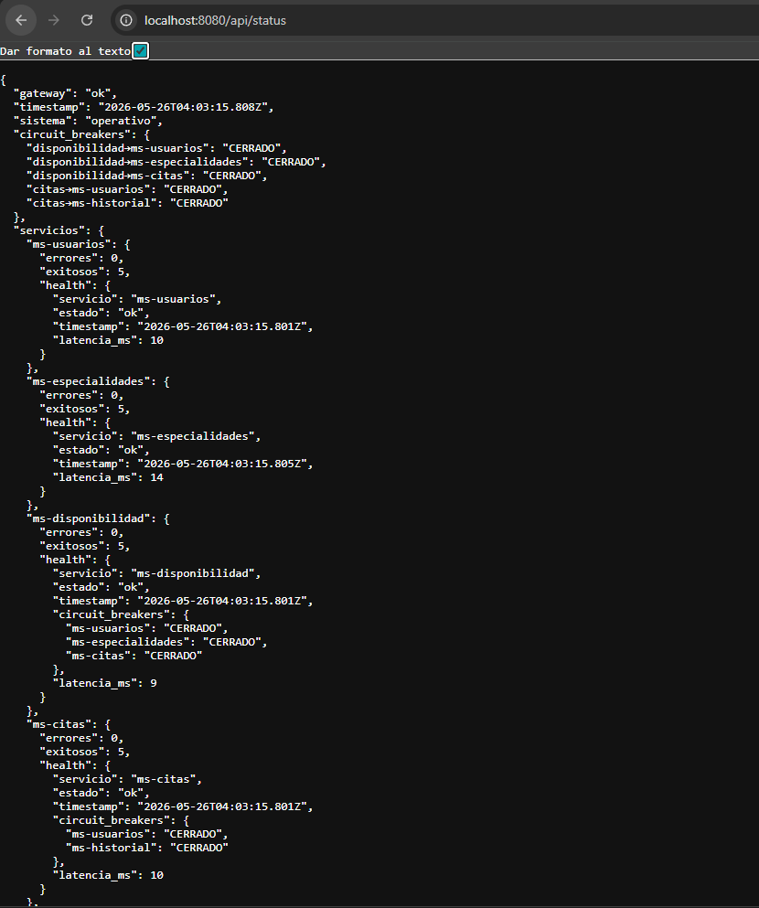

# DOCUMENTO TÉCNICO 


# 1. Descripción general del sistema
### Propósito del sistema

Es una plataforma distribuida que permite gestionar el ciclo completo de una cita médica: desde que un paciente agenda una consulta hasta que el médico la completa. Centraliza la administración de usuarios, disponibilidad de médicos, agendamiento y auditoría, todo expuesto a través de una interfaz web y una API unificada.


### Problemática que resuelve

En clínicas o consultorios sin sistema digitalizado, la gestión de citas se hace manualmente (llamadas, planillas, hojas de cálculo), lo que genera:

>Conflictos de horario —> dos pacientes agendados al mismo médico a la misma hora

>Sin trazabilidad —> no hay registro de quién canceló, cuándo, ni por qué

>Disponibilidad opaca —> el paciente no sabe qué horarios tiene libre el médico

>Datos desorganizados —> usuarios, horarios y citas mezclados sin separación clara

El sistema resuelve todo esto de forma automatizada con validaciones en tiempo real.

### Funcionalidades principales


| Funcionalidad  | Descripción |
| ------------- |:-------------:|
| Autenticación    | Login con email/contraseña, token JWT con expiración configurable     |
| Gestión de usuarios      | Alta, modificación y baja lógica de pacientes, médicos y admins  |
| Catálogo de especialidades      | Administración de especialidades médicas disponibles     |
| Disponibilidad de médicos      | Horarios semanales, bloqueos por ausencia y slots calculados automáticamente    |
| Agendamiento de citas      | Reserva con validación de conflictos, horario laboral (08:00–18:00) y duración fija (30 min)    |
| Estados de cita      | Flujo pendiente → confirmada → completada o cancelada     |
| Historial / auditoría     | Registro automático de cada cambio de estado de una cita  |
| Monitoreo   | stado en tiempo real de todos los servicios + circuit breakers vía /api/status     |


### Usuarios del sistema

| Rol | Descripción | 	Acciones principales|
| ------------- |:-------------:| -------:|
| Paciente     | Persona que solicita atención médica    |	Ver médicos disponibles, agendar y cancelar sus citas|
| Médico     | Profesional de salud   |Ver su agenda, gestionar su disponibilidad, completar citas|
| Admin      | Administrador de la plataforma    |	Gestionar usuarios, especialidades y configuración general|


### Alcance del proyecto
Incluye:

* 7 microservicios containerizados (Docker) con red interna aislada
* Base de datos desacoplada: 5 schemas independientes en MySQL
* API Gateway como punto único de entrada (localhost:8080)
* Interfaz web funcional servida por Nginx (localhost:80)
* Circuit Breaker con estados CERRADO / ABIERTO / SEMI_ABIERTO en los servicios críticos
* Degradación graceful (el sistema sigue operando aunque fallen servicios secundarios)
* Logs estructurados uniformes en todos los servicios
* Endpoint de monitoreo consolidado

No incluye (fuera de alcance):

* Notificaciones (email, SMS) al paciente
* Integración con sistemas externos (FHIS, HIS hospitalarios)
* Pago en línea
* Roles con permisos granulares (actualmente el control de acceso es básico)
* Entorno de producción con HTTPS / secrets managemen


# 2. Arquitectura final del sistema

### Diagrama 

```
                     [ citas_net — red Docker bridge ]
                                    │
                               ms-frontend
                                 :80 (nginx)
                                    │
                               ms-gateway
                                :8080 (API)
                                    │
         ┌──────────┬───────────────┼──────────────────┬──────────────┐
         ▼          ▼               ▼                  ▼              ▼
    ms-usuarios  ms-auth        ms-citas        ms-disponibilidad  ms-especialidades
      :3001       :3006           :3004               :3003            :3007
         │          │               │                  │                │
         │          │        [CB] ms-usuarios    [CB] ms-usuarios       │
         │          │        [CB] ms-historial   [CB] ms-especialidades │
         │          │               │            [CB] ms-citas          │
         │          │               ▼                  │                │
         │          │          ms-historial ◄──────────┘                │
         │          │            :3005                                   │
         │          │               │                                   │
         ▼          ▼               ▼                  ▼                ▼
    db_usuarios db_usuarios    db_citas         db_disponibilidad  db_especialidades
         └──────────┘               └────────────────────────────────────┘
                                              db_historial
                                                  │
                                    ┌─────────────┴──────────────┐
                                    │     MySQL 8.0 — :3307      │
                                    │  (5 schemas desacoplados)  │
                                    └────────────────────────────┘
```

# 3. Justificación de arquitectura

### ¿Por qué se dividió en microservicios?

El sistema maneja dominios de negocio claramente distintos que no comparten datos entre sí de forma directa: un usuario no es lo mismo que una cita, y una especialidad no depende de la disponibilidad. Forzar todo eso en un solo servicio crearía un monolito donde un bug en el historial podría tumbar el agendamiento completo.

La división permite que cada dominio:

* Falle de forma aislada — si ms-historial se cae, las citas siguen funcionando
* Escale de forma independiente — si hay muchas consultas de disponibilidad, solo se escala ese servicio
* Se desarrolle y despliegue por separado — cambiar la lógica de especialidades no requiere tocar citas


### Responsabilidades de cada servicio


| Servicio | Dominio | Responsabilidad única |
| :--- | :--- | :--- |
| **ms-auth** | Seguridad | Autenticar usuarios y emitir/verificar tokens JWT. No gestiona usuarios, solo credenciales |
| **ms-usuarios** | Identidad | CRUD de personas del sistema (pacientes, médicos, admins). Es la fuente de verdad de identidad |
| **ms-especialidades** | Catálogo | Administrar las especialidades médicas disponibles. Completamente independiente |
| **ms-disponibilidad** | Agenda | Calcular horarios libres de un médico cruzando su horario semanal, sus bloqueos y sus citas confirmadas |
| **ms-citas** | Operación central | Agendar, confirmar, cancelar y completar citas. Valida identidad vía ms-usuarios y registra eventos en ms-historial |
| **ms-historial** | Auditoría | Registrar cada cambio de estado de una cita. Solo escribe, nunca modifica |
| **ms-gateway** | Infraestructura | Ser el único punto de entrada público. Enruta requests y expone el monitoreo del sistema |


### Ventajas Obtenidas


#### 1. Aislamiento de Fallos con Degradación Graceful
Si ms-historial falla, ms-citas sigue creando citas — simplemente omite el registro de auditoría y lo loguea. El Circuit Breaker evita que el fallo en cascada bloquee el servicio completo.

#### 2. Base de Datos Desacoplada (Database per Service)
Cada servicio tiene su propio schema (db_citas, db_usuarios, etc.). No hay JOINs entre schemas en tiempo de ejecución — la integridad se valida por API. Esto permite cambiar el modelo de datos de un servicio sin afectar a los demás.

#### 3. Responsabilidades Claras (Single Responsibility Principle)
ms-auth solo autentica. ms-usuarios solo gestiona identidad. No hay lógica mezclada. Cuando algo falla, los logs indican exactamente qué servicio y qué operación falló.

#### 4. Observabilidad Uniforme
Todos los servicios emiten logs con el mismo formato [timestamp] [servicio] [nivel] mensaje, y todos exponen /health. El gateway agrega todo en /api/status con contadores y estado de circuit breakers.


### Dificultades encontradas

#### 1. Dependencia Circular de Servicios (`ms-citas`  `ms-disponibilidad`)
ms-disponibilidad necesita consultar citas confirmadas para calcular slots libres, y ms-citas originalmente dependía de ms-disponibilidad. Eso creaba un ciclo en el depends_on de Docker que impedía levantar los contenedores. Se resolvió eliminando la dependencia de ms-citas hacia ms-disponibilidad — ms-citas nunca necesitaba llamar a disponibilidad en la práctica.

#### 2. JOINs entre schemas
Al separar las bases de datos, las consultas que antes hacían JOIN usuarios dejaron de funcionar con error Table 'db_disponibilidad.usuarios' doesn't exist. Se resolvió de dos formas: usando sintaxis cross-schema de MySQL (JOIN db_usuarios.usuarios) donde era necesario, y denormalizando paciente_nombre y medico_nombre directamente en la tabla citas para evitar JOINs en las consultas frecuentes.

#### 3. Prepared statements con LIMIT
MySQL2 con pool.execute() usa prepared statements, que no aceptan LIMIT ? como parámetro. El error Incorrect arguments to mysqld_stmt_execute aparecía en ms-historial. Se resolvió con interpolación de string validando el valor como entero seguro antes de concatenarlo.

#### 4. Orden de arranque de contenedores
Los microservicios que dependen de otros deben esperar a que estén listos, no solo a que el proceso haya iniciado. Se resolvió con depends_on: condition: service_healthy en Docker Compose junto con healthchecks en cada servicio, y verificarDB() con reintentos al arrancar para tolerar que MySQL tarde en estar listo.

# 4. Tolerancia a fallos

### Manejo de errores

Todos los servicios tienen tres capas de manejo de errores:

**Capa 1 — Validación de entrada (antes de tocar la DB):**

```
// ms-citas/index.js
if (!paciente_id || !medico_id || !fecha || !hora_inicio || !hora_fin) {
  return res.status(400).json({ error: "Campos requeridos: paciente_id, medico_id, fecha, hora_inicio, hora_fin" });
}
if (hora_inicio >= hora_fin) {
  return res.status(400).json({ error: "hora_inicio debe ser anterior a hora_fin" });
}
```
 **Capa 2 — try/catch en cada ruta con respuesta estructurada:**
```
 // ms-usuarios/index.js
try {
  const [rows] = await pool.execute("SELECT ...");
  res.json({ total: rows.length, datos: rows });
} catch (err) {
  log("ERROR", `GET /usuarios — ${err.message}`);
  res.status(500).json({ error: "Error al consultar usuarios", detalle: err.message });
}

```

**Capa 3 — Middleware global para errores no capturados (presente en todos los servicios):**
```
app.use((err, req, res, next) => {
  log("ERROR", `Error no capturado en ${req.method} ${req.path}: ${err.message}`);
  res.status(500).json({ error: "Error interno del servidor" });
});
```

### Circuit Breaker

Implementado en ms-citas (protege llamadas a ms-usuarios y ms-historial) y ms-disponibilidad (protege llamadas a ms-usuarios, ms-especialidades y ms-citas).
```
class CircuitBreaker {
  constructor(nombre, { umbralFallas = 3, tiempoRecuperacion = 30000 } = {}) {
    this.nombre = nombre;
    this.estado = "CERRADO";  // CERRADO | ABIERTO | SEMI_ABIERTO
    this.fallas = 0;
    this.abiertaEn = null;
  }

  async ejecutar(fn) {
    if (this.estado === "ABIERTO") {
      const transcurrido = Date.now() - this.abiertaEn;
      if (transcurrido < this.tiempoRecuperacion) {
        const restante = Math.ceil((this.tiempoRecuperacion - transcurrido) / 1000);
        log("WARN", `[CB:${this.nombre}] ABIERTO — llamada bloqueada, reintento en ${restante}s`);
        throw new Error(`Servicio ${this.nombre} no disponible (circuit abierto)`);
      }
      this.estado = "SEMI_ABIERTO";  // deja pasar una llamada de prueba
    }

    try {
      const resultado = await fn();
      this.estado = "CERRADO";
      this.fallas = 0;
      return resultado;
    } catch (err) {
      this.fallas++;
      this.abiertaEn = Date.now();
      if (this.fallas >= this.umbralFallas || this.estado === "SEMI_ABIERTO") {
        this.estado = "ABIERTO";
        log("ERROR", `[CB:${this.nombre}] ABIERTO — ${this.fallas} falla(s): ${err.message}`);
      }
      throw err;
    }
  }
}
```

#### Flujos de estado
```

  CERRADO ──(3 fallas seguidas)──► ABIERTO ──(30 seg)──► SEMI_ABIERTO
     ▲                                                          │
     └──────────────── llamada exitosa ────────────────────────┘
                                                          │ falla
                                                       ABIERTO
```

#### Estado visible en tiempo real:
```
curl http://localhost:8080/api/citas/health

{
  "servicio": "ms-citas",
  "estado": "ok",
  "circuit_breakers": {
    "ms-usuarios": "CERRADO",
    "ms-historial": "CERRADO"
  }
}
```


### Recuperación de servicios

Problema real: MySQL tarda varios segundos en estar listo después de que Docker lo inicia. Sin protección, el servicio Node.js intenta conectar, falla y muere.

Solución — verificarDB() con reintentos (implementado en los 6 servicios con DB):
```
async function verificarDB(reintentos = 10, espera = 2000) {
  for (let intento = 1; intento <= reintentos; intento++) {
    try {
      await pool.execute("SELECT 1");
      log("INFO", `Conexion a DB establecida (intento ${intento}/${reintentos})`);
      return;
    } catch (err) {
      log("WARN", `DB no disponible, intento ${intento}/${reintentos}: ${err.message}`);
      if (intento === reintentos) {
        log("ERROR", "No se pudo conectar a la DB tras todos los intentos — abortando");
        process.exit(1);
      }
      await new Promise(r => setTimeout(r, espera));
    }
  }
}

// El servidor solo arranca si la DB responde
verificarDB().then(() => {
  app.listen(PORT, () => log("INFO", `Corriendo en puerto ${PORT}`));
});
```
Logs reales durante el arranque:

```
[ms-usuarios] [WARN]  DB no disponible, intento 1/10: connect ECONNREFUSED
[ms-usuarios] [WARN]  DB no disponible, intento 2/10: connect ECONNREFUSED
[ms-usuarios] [INFO]  Conexion a DB establecida (intento 3/10)
[ms-usuarios] [INFO]  Corriendo en puerto 3001
```

### LOGS

```
[2026-05-24T21:00:01.000Z] [ms-citas]          [INFO]  POST /citas — paciente=1 medico=3 fecha=2026-05-25 09:00-09:30
[2026-05-24T21:00:01.043Z] [ms-citas]          [INFO]  POST /citas — cita creada id=7
[2026-05-24T21:00:01.044Z] [ms-citas]          [WARN]  [CB:ms-historial] Falla 1/3: connect ECONNREFUSED
[2026-05-24T21:00:01.045Z] [ms-citas]          [WARN]  [FALLBACK] ms-historial no disponible para cita 7 — evento omitido
[2026-05-24T21:00:31.000Z] [ms-citas]          [INFO]  [CB:ms-historial] SEMI_ABIERTO — probando recuperacion
[2026-05-24T21:00:31.050Z] [ms-citas]          [INFO]  [CB:ms-historial] Recuperado exitosamente — Estado: CERRADO
[2026-05-24T21:00:45.000Z] [ms-disponibilidad] [WARN]  [FALLBACK] ms-citas no disponible para medico=3 fecha=2026-05-25 — generando slots sin verificar conflictos
[2026-05-24T21:01:00.000Z] [ms-gateway]        [WARN]  Ruta no encontrada: GET /api/noexiste
```

### Monitoreo básico

GET http://localhost:8080/api/status — consolida el estado de todo el sistema en una sola llamada:

```
{
  "gateway": "ok",
  "timestamp": "2026-05-24T21:30:55.000Z",
  "sistema": "operativo",
  "circuit_breakers": {
    "disponibilidad→ms-usuarios": "CERRADO",
    "disponibilidad→ms-especialidades": "CERRADO",
    "disponibilidad→ms-citas": "CERRADO",
    "citas→ms-usuarios": "CERRADO",
    "citas→ms-historial": "CERRADO"
  },
  "servicios": {
    "ms-usuarios": {
      "errores": 0,
      "exitosos": 12,
      "health": { "servicio": "ms-usuarios", "estado": "ok", "latencia_ms": 4 }
    },
    "ms-citas": {
      "errores": 0,
      "exitosos": 12,
      "health": {
        "estado": "ok",
        "circuit_breakers": { "ms-usuarios": "CERRADO", "ms-historial": "CERRADO" },
        "latencia_ms": 5
      }
    }
  }
}
```

# Escalabilidad y Administración


### Cómo se implementó la distribución de carga
El sistema actual no tiene balanceo de carga entre réplicas — cada microservicio corre como una sola instancia. Lo que sí existe es una distribución de responsabilidades a nivel arquitectural:

1. API Gateway como punto único de entrada
Todo el tráfico entra por ms-gateway (:8080) que lo enruta al servicio correcto según el prefijo de la ruta:
```
// ms-gateway/index.js
app.use("/api/usuarios",       buildProxy(MS_USUARIOS_URL, ...));
app.use("/api/disponibilidad", buildProxy(MS_DISPONIBILIDAD_URL, ...));
app.use("/api/citas",          buildProxy(MS_CITAS_URL, ...));
app.use("/api/historial",      buildProxy(MS_HISTORIAL_URL, ...));
app.use("/api/especialidades", buildProxy(MS_ESPECIALIDADES_URL, ...));
app.use("/api/auth",           buildProxy(MS_AUTH_URL, ...));
```

El cliente nunca habla directamente con un microservicio — solo con el gateway. Eso permite mover, reemplazar o replicar cualquier servicio sin cambiar el frontend.

## Connection pool por servicio
Cada microservicio maneja su propio pool de conexiones a MySQL, evitando que una carga alta en un servicio sature las conexiones de otro:
```
const pool = mysql.createPool({
  connectionLimit: 10,   // máximo 10 conexiones concurrentes por servicio
  waitForConnections: true,
});

```

### Red interna aislada
Los servicios se comunican por nombre de contenedor dentro de citas_net. Ningún microservicio expone puertos al host excepto gateway y frontend, lo que centraliza el control de tráfico.

# Cómo podría escalar el sistema

La arquitectura actual está preparada para escalar horizontalmente con cambios mínimos:

## Escalar un servicio específico con Docker Compose

```bash
# Si hay muchas consultas de disponibilidad, se replican solo ese servicio
docker compose up -d --scale ms-disponibilidad=3
```

Para que esto funcione correctamente faltaría agregar un balanceador frente a las réplicas. La arquitectura natural sería:

```plaintext
                  ms-gateway
                      │
              ┌───────┴────────┐
         Nginx / Traefik (LB)
              │       │       │
        instancia1  instancia2  instancia3
         ms-disponibilidad (x3)
              │       │       │
              └───────┬────────┘
                  db_disponibilidad
                  (una sola DB)
```

## Separar MySQL en instancias independientes

El sistema ya está preparado para esto porque cada servicio apunta a su propio schema. Cambiar `DB_HOST` en el `.env` de cada servicio es suficiente para apuntar a distintos servidores:

```yaml
# docker-compose.yml — cada servicio apuntaría a su propia DB
ms-citas:
  environment:
    DB_HOST: mysql-citas      # servidor dedicado para citas

ms-disponibilidad:
  environment:
    DB_HOST: mysql-disponibilidad   # servidor dedicado
```

# Limitaciones actuales

| Limitación | Impacto |
|------------|---------|
| Una réplica por servicio | Si `ms-citas` se cae, todo el agendamiento deja de funcionar |
| MySQL como único contenedor | Si el contenedor MySQL falla, todos los servicios pierden acceso a datos |
| Estado del Circuit Breaker en memoria | Si el contenedor se reinicia, los contadores y el estado del CB se reinician a CERRADO |
| Sin balanceador de carga real | El gateway actúa como proxy simple, no distribuye entre réplicas |
| Sin caché | Cada request a `/especialidades` o `/usuarios` va directo a DB aunque los datos no cambien |
| JWT sin revocación | Un token emitido es válido hasta que expira aunque el usuario sea desactivado |
| Sin HTTPS | El tráfico entre cliente y gateway no está cifrado |
| Sesión de gateway sin persistencia | Los contadores errores/exitosos del `/api/status` se pierden al reiniciar |

# Posibles mejoras futuras

## Infraestructura

| Mejora | Qué resuelve |
|--------|--------------|
| Traefik o Nginx como LB | Distribución real entre réplicas de un mismo servicio |
| Redis para Circuit Breaker | El estado del CB sobrevive reinicios y es compartido entre réplicas |
| Redis como caché | Especialidades y usuarios se cachean — reduce carga en DB y latencia |
| MySQL con réplicas read/write | Alta disponibilidad de datos — fallo de una instancia no tumba el sistema |
| HTTPS con certificado | Cifrado del tráfico cliente-servidor |

## Aplicación

| Mejora | Qué resuelve |
|--------|--------------|
| Cola de mensajes (RabbitMQ / Kafka) | El historial se registra de forma asíncrona — `ms-citas` no espera la respuesta |
| Blacklist de tokens JWT | Revocar sesiones de usuarios desactivados sin esperar la expiración |
| Rate limiting en el gateway | Protección contra abuso de la API |
| Paginación en todos los listados | Actualmente `/citas` y `/historial` devuelven todos los registros |

## Observabilidad

| Mejora | Qué resuelve |
|--------|--------------|
| Prometheus + Grafana | Métricas históricas, dashboards y alertas automáticas |
| Logs centralizados (ELK Stack) | Actualmente los logs están dispersos en cada contenedor |
| Trazabilidad distribuida (Jaeger) | Seguir un request desde el gateway hasta todos los servicios que tocó |


# Seguridad básica — Variables de entorno

## Qué son y para qué sirven

Las variables de entorno permiten separar la configuración sensible del código fuente. Credenciales, contraseñas y claves secretas no se escriben directamente en el código ni se suben al repositorio — viven en un archivo `.env` que cada desarrollador o servidor tiene localmente.

## Cómo está implementado

### `.env.example`

Se sube al repositorio, muestra la estructura sin valores reales:

```env
MYSQL_ROOT_PASSWORD=123
DB_USER=admin7
DB_PASSWORD=123
JWT_SECRET=cambia_esto_en_produccion
JWT_EXPIRES=8h
```

### `.env`

Archivo real con credenciales, nunca se sube al repositorio. Está excluido en `.gitignore`:

```gitignore
# .gitignore
.env
```

### `docker-compose.yml`

Lee las variables del `.env` con `${VARIABLE}`:

```yaml
mysql:
  environment:
    MYSQL_ROOT_PASSWORD: ${MYSQL_ROOT_PASSWORD}
    MYSQL_USER: ${DB_USER}
    MYSQL_PASSWORD: ${DB_PASSWORD}

ms-auth:
  environment:
    JWT_SECRET: ${JWT_SECRET}
    JWT_EXPIRES: ${JWT_EXPIRES:-8h}   # valor por defecto si no está definida
```

## Los microservicios las reciben como variables de proceso en Node.js

```javascript
const JWT_SECRET = process.env.JWT_SECRET || "dev_secret_change_me";
const DB_PASSWORD = process.env.DB_PASSWORD || "admin123";
```

## Flujo resumido

```plaintext
.env.example  →  developer copia como .env  →  agrega credenciales reales
                                                        │
                                               docker compose up
                                                        │
                                         cada contenedor recibe sus vars
                                         sin exponerlas en el código
```

## Qué se protege con esto

| Variable | Por qué no debe estar en el código |
|----------|------------------------------------|
| `MYSQL_ROOT_PASSWORD` | Acceso total a la base de datos |
| `DB_PASSWORD` | Acceso a los schemas de producción |
| `JWT_SECRET` | Si se filtra, cualquiera puede firmar tokens válidos |


# Evidencias
## Docker

### Docker ps

 
### Contenedores ejecutándose


## Comunicación

### Consumo entre servicios


### Respuestas HTTP


## Base de datos

### Datos almacenados


### Circuito CERRADO (funcionando normal)


Bajamos el servicio de ms-citas


Circuit Breaker — Descripción de la prueba
Para demostrar el comportamiento del Circuit Breaker se utilizó el endpoint GET /api/disponibilidad/slots (http://localhost:8080/api/disponibilidad/disponibilidad/slots?medico_id=3&fecha=2026-06-20), que internamente llama a ms-citas para verificar citas confirmadas antes de generar los slots disponibles.

Servicio funcionando: Con todos los contenedores activos, al consultar los slots desde el navegador el sistema respondía normalmente y los logs mostraban el CB en estado CERRADO.

Servicio caído: Se detuvo el contenedor ms-citas con docker stop ms_citas. Al refrescar el navegador, ms-disponibilidad intentaba contactar a ms-citas fallando los 3 reintentos internos del fetchConReintento, acumulando una falla en el CB por cada refresh. El sistema aplicaba degradación graceful — seguía respondiendo con slots pero sin verificar conflictos de citas, registrando [FALLBACK] en los logs.

Circuito abierto: Tras 3 fallas consecutivas el CB pasó a estado ABIERTO. Los refrescos siguientes ya no intentaban contactar a ms-citas — la llamada era bloqueada directamente mostrando en logs [CB:ms-citas] ABIERTO — llamada bloqueada, reintento en Xs. Esto se verificó en GET /api/disponibilidad/health donde "ms-citas" aparecía como "ABIERTO".

Recuperación: Se reinició ms-citas con docker start ms_citas. Tras 30 segundos el CB pasó a SEMI_ABIERTO y dejó pasar una llamada de prueba. Al ser exitosa, el circuito volvió a CERRADO automáticamente, confirmado tanto en los logs (Recuperado exitosamente — Estado: CERRADO) como en el endpoint de health.


## Monitoreo — Descripción de la prueba

**Logs:** Los logs se observaron en tiempo real desde la terminal con `docker logs -f ms_disponibilidad`, mostrando cada operación con formato uniforme `[timestamp] [servicio] [nivel] mensaje`. Durante las pruebas fueron visibles los niveles INFO para operaciones exitosas, WARN para fallos recuperables y reintentos del Circuit Breaker, y ERROR cuando el circuito se abría tras 3 fallas consecutivas.


**Health checks:** Cada microservicio expone un endpoint `/health` consultable directamente desde el navegador. Se verificó el estado individual de cada servicio navegando a:
```
http://localhost:8080/api/auth/health
http://localhost:8080/api/usuarios/health
http://localhost:8080/api/especialidades/health
http://localhost:8080/api/disponibilidad/health
http://localhost:8080/api/citas/health
http://localhost:8080/api/historial/health
```
Los servicios ms-disponibilidad y ms-citas además exponen el estado actual de sus Circuit Breakers dentro de la misma respuesta.


**Validación de disponibilidad:** El monitoreo consolidado del sistema completo se realizó desde el navegador en:
```
http://localhost:8080/api/status
```
Este endpoint consulta en paralelo el `/health` de los 6 microservicios y retorna en una sola respuesta el estado general del sistema (`"operativo"` o `"degradado"`), la latencia de cada servicio, los contadores de llamadas exitosas y errores acumulados desde el arranque, y el estado de todos los Circuit Breakers agrupados al nivel raíz. Durante la prueba del CB, este endpoint permitió observar en tiempo real cómo el estado de `ms-citas` cambiaba de `CERRADO` a `ABIERTO` y finalmente volvía a `CERRADO` tras la recuperación.


