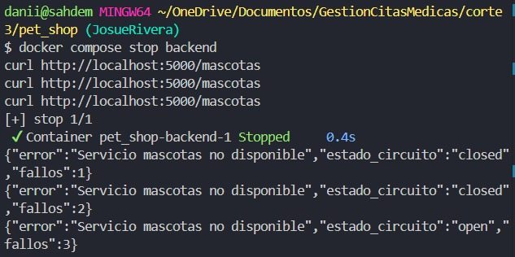
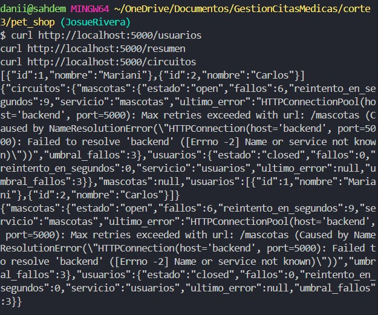
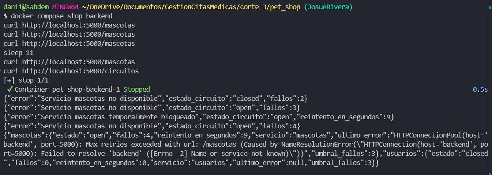
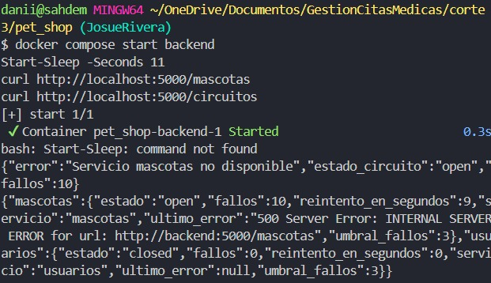
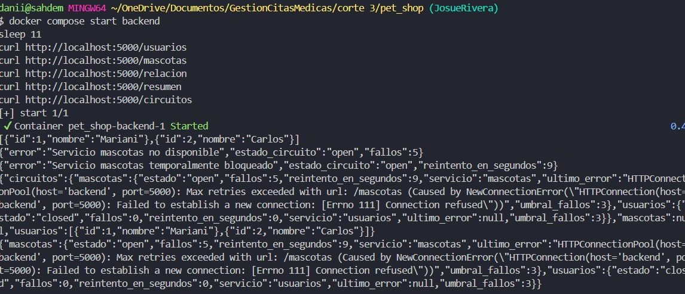

# Laboratorio Circuit Breaker - Pet Shop

Proyecto trabajado en la carpeta `corte 3/pet_shop`.

El laboratorio consiste en observar que ocurre cuando falla un microservicio, extender el Circuit Breaker a los endpoints del gateway e implementar recuperacion con estado `half-open`.

## Estructura del proyecto

```text
pet_shop/
├── backend/
│   └── app.py
├── gateway/
│   └── app.py
├── usuarios/
│   └── app.py
├── evidencias/
│   ├── fase1.png
│   ├── fase2.png
│   ├── fase3.png
│   ├── fase4.png
│   └── fase5.png
├── docker-compose.yml
└── README.md
```

## Servicios

- `gateway`: servicio principal expuesto en `http://localhost:5000`.
- `backend`: servicio de mascotas expuesto en `http://localhost:5002`.
- `usuarios`: servicio de usuarios expuesto en `http://localhost:5001`.
- `db`: base de datos MySQL usada por mascotas.

## Endpoints del gateway

- `GET /usuarios`
- `GET /mascotas`
- `POST /mascotas`
- `GET /relacion`
- `GET /resumen`
- `GET /circuitos`

## Fase 1 - Observar

### Que se hizo

Se apago el servicio de mascotas y se hicieron varias peticiones al gateway.

```bash
docker compose stop backend
curl http://localhost:5000/mascotas
curl http://localhost:5000/mascotas
curl http://localhost:5000/mascotas
docker compose logs gateway
```

### Que se observo

El gateway intenta comunicarse con el servicio `backend`. Cuando mascotas no esta disponible, responde con error `503` y registra fallos. Al llegar al umbral definido, abre el circuito para dejar de insistir contra el servicio caido.

### Se protege o insiste

El sistema se protege. Insiste solo hasta llegar al numero maximo de fallos y despues abre el circuito.

### Evidencia



## Fase 2 - Aplicar Circuit Breaker

### Que se hizo

Se extendio el Circuit Breaker para que no funcione solamente en `/mascotas`, sino tambien en los endpoints que llaman a otros servicios.

Se implemento una clase reutilizable `CircuitBreaker` y una funcion central `call_service`, evitando copiar la misma logica en cada endpoint.

```bash
curl http://localhost:5000/usuarios
curl http://localhost:5000/resumen
curl http://localhost:5000/circuitos
```

### Decisiones tomadas

Cada servicio debe tener su propio contador de fallos. Por eso existen circuitos independientes para:

- `mascotas`
- `usuarios`

El circuito tambien debe abrirse de forma independiente por servicio. Si falla mascotas, usuarios puede seguir funcionando.

### Evidencia



## Fase 3 - Investigar Half-Open

### Que significa half-open

`half-open` es el estado intermedio del Circuit Breaker. Ocurre cuando el circuito estaba abierto, pero ya paso el tiempo de espera y el gateway permite una llamada de prueba.

### Cuando se vuelve a intentar una llamada

Se vuelve a intentar despues de la espera controlada. En este proyecto se definio:

```python
RECOVERY_TIMEOUT_SECONDS = 10
```

En Git Bash se uso:

```bash
sleep 11
curl http://localhost:5000/mascotas
curl http://localhost:5000/circuitos
```

### Que pasa si el servicio vuelve a fallar

Si la llamada de prueba falla, el circuito vuelve a `open` y se reinicia el tiempo de espera.

### Evidencia



## Fase 4 - Implementar Recuperacion

### Que se hizo

Se implemento recuperacion automatica con tres estados:

- `closed`: el servicio funciona normalmente.
- `open`: el servicio fallo varias veces y el gateway bloquea temporalmente las llamadas.
- `half-open`: el gateway permite una llamada de prueba para validar si el servicio se recupero.

```bash
docker compose start backend
sleep 11
curl http://localhost:5000/mascotas
curl http://localhost:5000/circuitos
```

### Resultado

Cuando el servicio de mascotas vuelve a responder correctamente, el circuito se cierra y el contador de fallos se reinicia.

### Evidencia



## Fase 5 - Validar

### Escenarios probados

1. Servicio funcionando.
2. Servicio caido.
3. Circuito abierto.
4. Recuperacion del servicio.

```bash
curl http://localhost:5000/usuarios
curl http://localhost:5000/mascotas
curl http://localhost:5000/relacion
curl http://localhost:5000/resumen
curl http://localhost:5000/circuitos
```

### Resultado

El endpoint `/usuarios` sigue disponible aunque falle mascotas. El endpoint `/resumen` muestra el estado de ambos servicios. Cuando mascotas se recupera, el circuito pasa de `open` a `half-open` y finalmente vuelve a `closed` si la llamada de prueba funciona.

### Evidencia



## Codigo implementado

### `gateway/app.py`

Se implemento:

- Clase `CircuitBreaker`.
- Contador independiente por servicio.
- Estado `open`.
- Estado `half-open`.
- Recuperacion automatica.
- Endpoint `/circuitos`.
- Endpoint `/resumen`.

### `backend/app.py`

Se agrego inicializacion de la tabla `mascotas` para evitar errores internos cuando la base de datos no tenia la tabla creada.

## Analisis final

### Que cambio en el comportamiento del sistema

Antes el gateway solo tenia proteccion basica para mascotas. Ahora protege todos los endpoints que dependen de microservicios y puede recuperarse automaticamente despues de una falla.

### Que decisiones se tomaron

Se manejo un Circuit Breaker por servicio para que una falla de mascotas no afecte usuarios. Tambien se centralizo la logica de llamadas HTTP para no repetir codigo.

### Que dificultades se encontraron

La principal dificultad fue diferenciar entre un servicio apagado y un servicio encendido pero fallando internamente. Durante las pruebas, mascotas respondia `500` porque faltaba crear la tabla en MySQL; por eso se agrego la inicializacion de la tabla.

## Evidencias

Las evidencias estan en la carpeta `evidencias/`:

- `evidencias/fase1.png`
- `evidencias/fase2.png`
- `evidencias/fase3.png`
- `evidencias/fase4.png`
- `evidencias/fase5.png`
